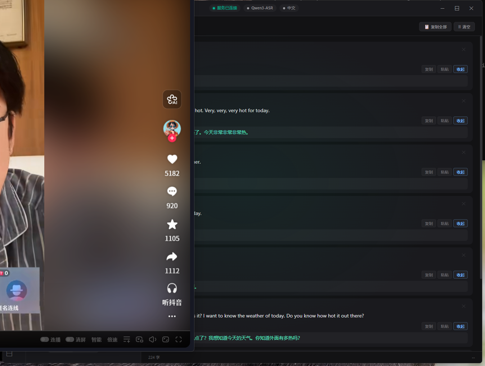
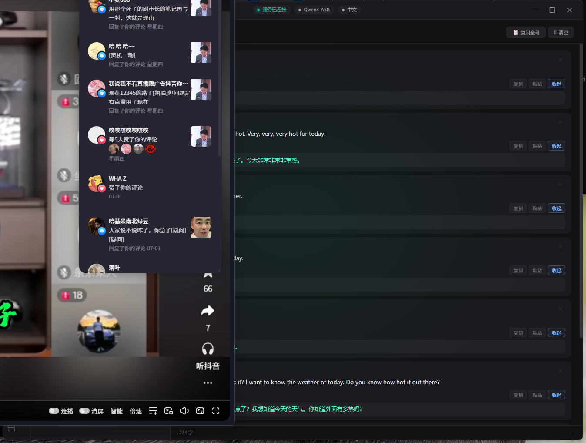
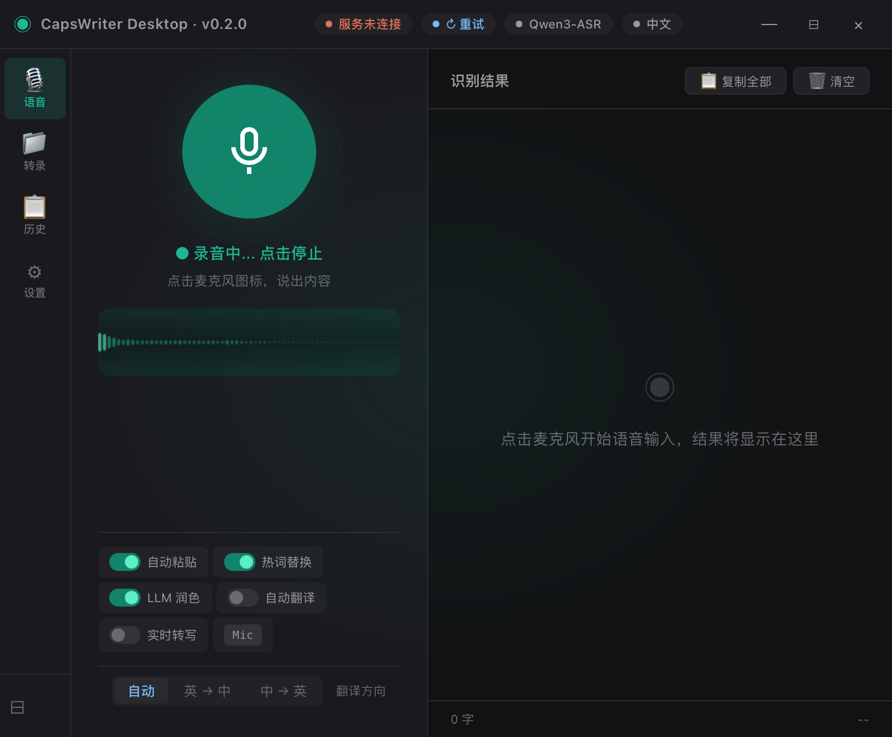

<div align="center">

# ◉ CapsWriter Desktop

**完全离线的语音输入桌面应用**

基于 [Tauri](https://tauri.app) + [sherpa-onnx](https://github.com/k2-fsa/sherpa-onnx) 构建，支持中文 / 英文 / 日文实时语音识别，无需联网，数据安全无忧。

[](https://tauri.app)
[](https://rust-lang.org)
[](https://python.org)
[](LICENSE)

</div>

---

## ✨ 功能特性

| 功能 | 说明 |
|------|------|
| 🎙 **实时语音输入** | 点击麦克风即可语音输入，识别结果实时显示，支持一键复制/粘贴到当前窗口 |
| 🌐 **完全离线运行** | 基于 sherpa-onnx 本地推理，无需网络，隐私安全 |
| 📁 **文件转录** | 拖拽或选择音频文件（WAV/MP3/M4A/FLAC/OGG/AAC）进行转录，支持导出 SRT/TXT/JSON |
| 📋 **历史记录** | 按日期归档所有转录记录，支持全文搜索、单条删除、一键清空 |
| 🔄 **实时翻译** | 支持中英互译（英→中 / 中→英），基于 LLM API |
| 📝 **热词管理** | 自定义热词列表，支持正则规则替换（如 `大语言模型 -> LLM`） |
| 🤖 **LLM 润色** | 接入 DeepSeek / OpenAI / Ollama 等大语言模型，对识别结果进行智能润色 |
| ⚡ **GPU 加速** | 支持 CPU 和 DirectML（GPU）两种推理后端 |
| 🔧 **系统托盘** | 最小化到系统托盘，后台运行不打扰工作 |
| 🎨 **现代 UI** | 暗色主题，动态波形可视化，流畅动画过渡 |

> **注意**: LLM 翻译和润色功能为可选功能，需要用户自行在「设置 → LLM 角色」中配置 API 地址和密钥。项目默认不包含任何第三方 API Key。

---

## 📸 界面预览

### 🎙 语音输入

<p align="center">
  
</p>

实时语音输入，动态波形可视化，一键复制/粘贴到当前窗口。

### 📁 文件转录

<p align="center">
  
</p>

拖拽或选择音频文件进行转录，支持 WAV/MP3/M4A/FLAC/OGG/AAC，可导出 SRT/TXT/JSON。

### 📋 历史记录

<p align="center">
  
</p>

按日期归档所有转录记录，支持全文搜索、单条删除、一键清空。

### ⚙ 设置

<p align="center">
  
</p>

模型配置、快捷键、热词管理、LLM 润色、输出设置一目了然。

---

## 🛠 技术栈

```
┌─────────────────────────────────────────────────────┐
│              CapsWriter Desktop 架构                  │
├─────────────────────────────────────────────────────┤
│                                                     │
│   ┌───────────────────────────────────────────┐     │
│   │            Tauri 2 (Rust)                  │     │
│   │  ┌─────────────┐  ┌──────────────────┐   │     │
│   │  │ 系统托盘    │  │ 剪贴板/快捷键    │   │     │
│   │  │ 窗口管理    │  │ 文件对话框       │   │     │
│   │  └─────────────┘  └──────────────────┘   │     │
│   │  ┌────────────────────────────────────┐   │     │
│   │  │ Sidecar Manager (WebSocket:6016)   │   │     │
│   │  └──────────────┬─────────────────────┘   │     │
│   └─────────────────┼─────────────────────────┘     │
│                     │                               │
│   ┌─────────────────▼─────────────────────────┐     │
│   │        Python ASR Server (sidecar)         │     │
│   │  ┌─────────────────────────────────────┐   │     │
│   │  │  sherpa-onnx · Qwen3-ASR 0.6B      │   │     │
│   │  │  (int8 量化，CPU/DML 推理)          │   │     │
│   │  └─────────────────────────────────────┘   │     │
│   └───────────────────────────────────────────┘     │
│                                                     │
│   ┌───────────────────────────────────────────┐     │
│   │        Vite + Vanilla JS (Frontend)        │     │
│   │  ┌────────┐ ┌──────┐ ┌──────┐ ┌──────┐  │     │
│   │  │ 语音   │ │ 转录 │ │ 历史 │ │ 设置 │  │     │
│   │  └────────┘ └──────┘ └──────┘ └──────┘  │     │
│   └───────────────────────────────────────────┘     │
└─────────────────────────────────────────────────────┘
```

| 层级 | 技术 | 用途 |
|------|------|------|
| **桌面框架** | Tauri 2 | 窗口管理、系统托盘、原生对话框、剪贴板 |
| **后端语言** | Rust | 音频采集 (cpal)、WebSocket 通信、配置管理 |
| **ASR 引擎** | sherpa-onnx + Qwen3-ASR | 离线语音识别 (int8 量化，~600M 参数) |
| **AI 服务** | Python WebSocket Server | ASR 推理服务，自动随应用启停 |
| **前端** | Vite + Vanilla JS | UI 渲染、波形动画、交互逻辑 |
| **LLM 集成** | DeepSeek / OpenAI / Ollama | 可选的翻译与文本润色（需用户自行配置 API Key） |

---

## 🚀 快速开始

### 方式一：下载预编译安装包

前往 [Releases](https://github.com/yourname/caps-writer-desktop/releases) 页面下载最新版本：

- **`CapsWriter-Desktop_0.1.0_x64-setup.exe`** — NSIS 安装程序（推荐）
- **`CapsWriter-Desktop_0.1.0_x64_en-US.msi`** — MSI 安装程序

> ⚠️ 首次运行需要安装 Python 依赖（见下方 [Python 环境准备](#python-环境准备)）。模型文件已包含在仓库的 `models/` 目录中，无需额外下载。

### 方式二：从源码构建

#### 环境要求

| 工具 | 版本要求 | 说明 |
|------|----------|------|
| [Node.js](https://nodejs.org) | ≥ 18 | 前端构建 |
| [Rust](https://rustup.rs) | ≥ 1.70 | Tauri 后端编译 |
| [Python](https://python.org) | ≥ 3.10 | ASR 推理服务 |
| [Tauri CLI](https://tauri.app) | 2.x | `cargo install tauri-cli` |

#### 克隆并构建

```bash
# 1. 克隆仓库
git clone https://github.com/yourname/caps-writer-desktop.git
cd caps-writer-desktop

# 2. 安装前端依赖
npm install

# 3. 安装 Python 依赖（ASR 服务端）
pip install numpy websockets

# 4. （可选）安装 sherpa-onnx 以启用真实 ASR 引擎
# pip install sherpa-onnx
# 不安装 sherpa-onnx 时，应用会使用 Mock 引擎（返回测试文本）

# 5. 开发模式运行
npm run dev

# 6. 或构建生产版本
npm run build
```

构建产物位于：`src-tauri/target/release/bundle/`

#### Python 环境准备

ASR 引擎需要 Python 运行时和相关依赖：

```bash
cd sidecar
pip install -r requirements.txt
```

> 💡 应用启动时会自动查找 `python` 命令，请确保 Python 已添加到系统 PATH。

---

## 📖 使用指南

### 🎙 语音输入

1. 启动应用后，点击界面中央的**麦克风按钮**开始录音
2. 开始说话，界面会显示动态波形和录音状态
3. 再次点击麦克风停止录音，识别结果将自动显示在右侧区域
4. 点击结果条目上的 **复制** 或 **粘贴** 按钮

> **录音模式**: 点击麦克风按钮切换录音开始/停止（与原版 CapsWriter 的按住录音不同）。鼠标侧键也可触发。

#### 🔄 服务端自动启动

应用启动时，Python ASR 服务会作为子进程（sidecar）自动启动，无需手动运行。标题栏会显示连接状态：
- 🟢 **服务已连接** — ASR 引擎就绪，可正常使用
- 🟡 **启动服务中** — 正在加载模型，请稍等
- 🔴 **服务未连接** — Python 服务未启动，可点击「↻ 重试」

#### 快捷设置栏

| 开关 | 说明 |
|------|------|
| 自动粘贴 | 识别完成后自动粘贴到当前活动窗口 |
| 热词替换 | 启用自定义热词和正则规则替换 |
| LLM 润色 | 启用大语言模型对识别结果进行润色 |
| 自动翻译 | 识别完成后自动翻译（中英互译） |

### 📁 文件转录

1. 切换到 **转录** 页面
2. 拖拽音频文件到指定区域，或点击 **选择文件** 按钮
3. 支持格式：WAV、MP3、M4A、FLAC、OGG、AAC
4. 转录完成后，可导出为 **SRT**（字幕）、**TXT**（纯文本）或 **JSON** 格式

### 📋 历史记录

- 左侧按日期归档所有识别记录
- 支持**全文搜索**，输入关键词即可快速定位
- 每条记录支持复制、翻译、删除
- 右上角可**清空全部**历史

### ⚙ 设置

| 设置项 | 说明 |
|--------|------|
| 识别引擎 | 选择 ASR 模型（默认 Qwen3-ASR） |
| 识别语言 | 自动检测 / 中文 / 英文 / 日文 |
| GPU 加速 | CPU 或 DirectML (GPU) |
| 数字格式化 | 十五六 → 15~16 |
| 热词管理 | 编辑热词列表（支持 `原词 -> 替换词` 格式） |
| LLM 配置 | 选择 LLM 后端，配置 API 地址和密钥（**需用户自行配置，不自带 API Key**） |
| 输出设置 | 末尾标点去除、录音保存、粘贴行为 |

### 🔑 LLM API 配置

LLM 翻译和润色功能需要用户自行配置 API Key：

1. 打开 **设置 → LLM 角色**
2. 选择后端（DeepSeek / OpenAI / Ollama）
3. 填写 **API 地址**、**模型名称** 和 **API Key**
4. 点击「🔌 测试连接」验证配置
5. 保存设置

> ⚠️ **安全提示**: API Key 保存在本地配置文件中（`%APPDATA%/caps-writer-desktop/llm_config.json`），请勿将此文件分享给他人。

---

## 🗂 项目结构

```
caps-writer-desktop/
├── src/                          # 前端源码
│   ├── index.html                #   HTML 入口
│   ├── app.js                    #   主应用逻辑
│   └── styles.css                #   样式文件
├── src-tauri/                    # Rust 后端
│   ├── src/
│   │   ├── main.rs               #   应用入口
│   │   ├── lib.rs                #   Tauri 插件注册
│   │   ├── commands.rs           #   IPC 命令（录音/配置/历史/翻译）
│   │   ├── sidecar.rs            #   Python 服务进程管理
│   │   ├── state.rs              #   应用状态定义
│   │   └── tray.rs               #   系统托盘
│   ├── Cargo.toml                #   Rust 依赖
│   └── tauri.conf.json           #   Tauri 配置
├── sidecar/                      # Python ASR 服务
│   ├── caps-writer-server.py     #   服务入口
│   ├── requirements.txt          #   Python 依赖
│   └── server/
│       ├── server.py             #   WebSocket ASR 服务
│       ├── asr_engine.py         #   ASR 引擎抽象层
│       └── protocol.py           #   通信协议定义
├── models/                       # 预训练模型
│   └── sherpa-onnx-qwen3-asr-0.6B-int8-2026-03-25/
│       ├── conv_frontend.onnx
│       ├── encoder.int8.onnx
│       ├── decoder.int8.onnx
│       └── tokenizer/
├── dist/                         # Vite 构建产物
├── package.json
└── vite.config.js
```

---

## 🔧 配置文件

应用配置存储在用户目录下：

```
%APPDATA%/caps-writer-desktop/    # Windows
~/.config/caps-writer-desktop/    # Linux/macOS
├── config.json                    # 主配置
├── llm_config.json               # LLM API 配置（含 API Key，请勿分享）
├── hotwords.txt                   # 热词列表
└── history/                       # 历史记录
    ├── 2025-07-05.json
    ├── 2025-07-04.json
    └── ...
```

---

## 🤝 参与贡献

欢迎提交 Issue 和 Pull Request！

```bash
# Fork 并克隆
git clone https://github.com/yourname/caps-writer-desktop.git

# 创建特性分支
git checkout -b feature/amazing-feature

# 提交更改
git commit -m 'Add amazing feature'

# 推送分支
git push origin feature/amazing-feature

# 发起 Pull Request
```

### 开发调试

```bash
# 安装所有依赖
npm install
cd sidecar && pip install -r requirements.txt && cd ..

# 启动开发模式（热重载前端）
npm run dev
```

---

## 🙏 致谢

- [CapsWriter-Offline](https://github.com/HaujetZhao/CapsWriter-Offline) — 原版 CapsWriter 灵感来源
- [sherpa-onnx](https://github.com/k2-fsa/sherpa-onnx) — 本地 ASR 推理引擎
- [Tauri](https://tauri.app) — 跨平台桌面应用框架
- [Qwen3-ASR](https://github.com/QwenLM) — 通义千问语音识别模型

---

## 📄 许可证

本项目采用 [MIT License](LICENSE) 开源许可证。

---

<div align="center">

**如果这个项目对你有帮助，请给个 ⭐ Star 支持一下！**

</div>
